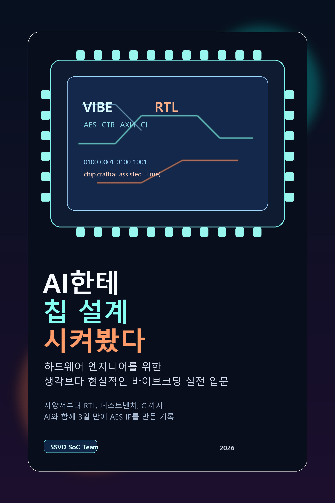

# AI한테 칩 설계 시켜봤다

대규모 언어 모델이 소프트웨어 개발의 생산성을 바꾸고 있다는 이야기는 이제 낯설지 않다. 하지만 하드웨어 개발, 특히 사양서 작성부터 RTL 구현, 검증, 소프트웨어 작성, 리뷰, 문서화까지 이어지는 ASIC/IP 개발의 전체 흐름에서도 같은 변화가 가능할까. 이 질문에 대한 하나의 구체적인 답이 이번 프로젝트였다.

이 프로젝트에서는 AES-128 CTR 모드 복호화 하드웨어 IP를 실제로 정의하고 구현했다. 목표는 단순히 “AI가 코드를 얼마나 빨리 쓰는가”를 보는 것이 아니었다. 사양을 구조화하고, Verilog RTL을 작성하고, 테스트벤치를 만들고, C 기반 호스트 소프트웨어를 붙이고, 다른 AI로 교차검증하고, 마지막에는 그 전 과정을 책으로 정리하는 데까지 AI를 협업 파트너로 투입했을 때 어떤 개발 방식이 가능한지를 확인하는 것이 핵심이었다.

결과적으로 3일 동안 하나의 IP 개발 사이클이 처음부터 끝까지 연결됐다. 사양서는 Markdown으로 정리됐고, RTL은 모듈 단위로 분해돼 구현됐으며, 시뮬레이션과 Verilator 기반 검증 환경, 호스트 소프트웨어, GitHub Actions 기반 CI까지 이어졌다. 이후 그 과정을 다시 정리해 책으로 엮으면서, “AI와 함께 하드웨어를 만든다”는 말이 추상적인 구호가 아니라 재현 가능한 워크플로우가 될 수 있음을 확인했다.

프로젝트의 출발점은 거창한 문서가 아니라, 아주 길고 구체적인 한 편의 사용자 프롬프트였다. 처음 요청은 AES decryption hardware 엔진의 개발 사양서를 만들어 달라는 것이었고, 그 안에는 memory-to-memory 동작, descriptor 기반 명령 처리, interrupt/resume 흐름, AES-128 CTR 모드, 버퍼 레이아웃, throughput 요구사항까지 실제 IP 개발자가 검토해야 할 내용이 빽빽하게 담겨 있었다.

> "칩업체의 IP개발자가 설계할 AES decryption hardware 엔진의 개발사양서 문서야."
>
> "이 IP는 memory to memory 방식으로 동작하고 버스 마스터 및 레지스터 읽기 쓰기를 위한 슬레이브 인터페이스를 갖고 있어."
>
> "..."
>
> "AES는 128bit CTR체인모드로 decrypt해야해."
>
> "..."
>
> "throughput 성능 요구도 사양서에 기술되어야해."

## 왜 이 사례가 중요했는가

하드웨어 개발은 소프트웨어보다 AI 적용이 느릴 것이라고 보는 시각이 많다. 인터페이스 제약이 더 엄격하고, 버그 비용이 크며, 구현 이후의 검증 부담도 훨씬 크기 때문이다. 실제로 RTL 한 줄의 실수는 테스트벤치, 드라이버, 문서, 나중에는 합성과 타이밍 검토까지 연쇄적으로 영향을 준다.

그럼에도 불구하고 이번 사례가 흥미로웠던 이유는, AI가 단지 “코드를 대신 써 주는 보조 도구”에 머무르지 않았기 때문이다. 사양 단계에서는 요구사항을 구조화하고 누락된 결정을 드러내는 역할을 했고, 구현 단계에서는 반복적인 모듈 골격과 상태기계, 레지스터 맵, 소프트웨어 인터페이스를 빠르게 전개했다. 검증 단계에서는 테스트 시나리오를 정리하고 결함이 숨어 있을 만한 지점을 좁히는 데 도움을 줬다. 마지막으로 문서화 단계에서는 개발 중 축적된 산출물을 다시 독자가 읽을 수 있는 이야기 구조로 재구성하는 데까지 활용됐다.

즉, AI의 가치는 특정 파일 하나를 빨리 만드는 데 있지 않았다. 여러 공정으로 끊어져 있던 하드웨어 개발의 흐름을 더 촘촘하게 연결하고, 엔지니어가 판단해야 할 지점에 더 많은 시간을 쓰게 만든다는 데 있었다.

## 사양서에서 시작된 개발 흐름

출발점은 구현이 아니라 사양서였다. 무엇을 만들지 명확하지 않으면 AI는 빠르게 많은 텍스트와 코드를 만들어내지만, 그 결과물은 쉽게 흔들린다. 그래서 먼저 AES 복호화 IP의 요구사항을 문서로 정리했다. AXI4 64-bit Manager와 AXI4-Lite Subordinate 인터페이스, descriptor 기반 커맨드 구조, CRC-32 지원, 처리량 목표 같은 핵심 조건을 초기에 고정했다.

이 단계에서 AI는 빈 종이를 채우는 역할보다, 사양서 형식을 빠르게 갖추고 질문해야 할 항목을 드러내는 역할에서 특히 유용했다. 덕분에 개발자는 “어떻게 쓸까”보다 “무엇을 결정해야 하나”에 집중할 수 있었다. 하드웨어 프로젝트에서 이 차이는 생각보다 크다. 사양이 먼저 서 있으면 이후의 RTL, 테스트벤치, 소프트웨어, 문서가 모두 같은 축을 공유할 수 있기 때문이다.

## RTL 구현과 검증을 동시에 당겼다

사양이 정리된 뒤에는 RTL 코딩이 이어졌다. 제어 로직, descriptor fetch, AXI 매니저, 입력 제어, 출력 제어, writeback, register file 같은 주요 블록이 모듈 단위로 나뉘어 작성됐다. AI는 반복 구조가 있는 RTL 작성에 특히 강점을 보였다. 포트 선언, 상태 전이의 뼈대, 레지스터 묶음, 공통 핸드셰이크 패턴처럼 사람이 직접 타이핑하면 시간이 많이 들지만 규칙성은 높은 작업에서 속도가 크게 올라갔다.

중요한 점은 여기서 사람이 빠지는 것이 아니라, 사람의 역할이 이동했다는 것이다. 엔지니어는 코드를 한 줄씩 손으로 쓰는 시간보다, 모듈 분해가 적절한지, 인터페이스가 일관적인지, 리셋과 에러 플로우가 안전한지, 설계 의도가 제대로 반영됐는지를 계속 확인하는 쪽으로 무게중심을 옮겼다.

검증도 뒤로 미루지 않았다. 테스트벤치와 Verilator 환경을 병행해 준비하면서 설계와 검증이 같은 속도로 진전되도록 했다. 하드웨어에서 AI를 쓸 때 가장 위험한 순간은 “코드는 빨리 나왔는데 검증이 뒤따르지 못하는 상황”이다. 이번 사례는 그 반대로, RTL과 검증 환경을 나란히 끌고 가야 AI의 속도가 실제 생산성으로 이어진다는 점을 보여줬다.

## 소프트웨어와 시스템 관점까지 확장됐다

이 프로젝트는 RTL에서 멈추지 않았다. C 기반 호스트 소프트웨어를 작성해 레지스터 접근, 테스트 실행, 레퍼런스 비교까지 이어 갔다. 여기서도 AI는 하드웨어-소프트웨어 경계면을 빠르게 메우는 데 유용했다. 레지스터 정의와 드라이버 코드, 테스트용 인터페이스, 참조용 소프트웨어 구현을 함께 정리함으로써, 하드웨어 블록이 시스템 안에서 어떤 방식으로 사용될지를 더 빨리 확인할 수 있었다.

이 지점은 현업 하드웨어 엔지니어에게 특히 중요하다. 오늘날 많은 IP 개발은 RTL만 맞는다고 끝나지 않는다. 소프트웨어에서 어떻게 제어하고 검증할 것인지까지 연결돼야 실제 프로젝트에서 살아남는다. AI와 함께한 이번 흐름은 그 연결 비용을 줄여 줬다.

## 다른 AI를 리뷰어로 세워 교차검증했다

AI와 함께 개발할 때 자주 간과되는 부분은 리뷰의 독립성이다. 같은 AI에게 설계와 자기 리뷰를 모두 맡기면, 놓친 문제를 다시 놓칠 가능성이 높다. 이번 프로젝트에서는 이 한계를 피하기 위해 다른 AI를 리뷰어로 투입했다. Claude가 중심적으로 생성한 코드와 구조를 다른 AI가 별도의 시각에서 점검하도록 한 것이다.

이 교차검증 과정은 단순한 “감상 리뷰”가 아니라, AXI 프로토콜 준수, outstanding 처리, 에러 플로우, 리셋 안정성, 코너 케이스 같은 하드웨어 관점의 체크리스트에 기반해 진행됐다. 그 결과 작성자 AI가 자연스럽게 넘어갔던 부분을 다른 AI가 지적하는 장면이 실제로 나왔다. 사람 팀에서 작성자와 리뷰어를 나누는 이유가 AI 협업에서도 그대로 유효하다는 점을 보여주는 대목이었다.

AI가 강력해질수록 리뷰는 덜 중요해지는 것이 아니라 오히려 더 중요해진다. 생성 속도가 빨라질수록 검증과 판정의 품질이 전체 결과를 좌우하기 때문이다.

## 책 집필까지 이어지며 하나의 사례가 됐다

이번 작업의 마지막 단계는 구현 완료가 아니라 기록의 정리였다. 사양서 작성부터 RTL 코딩, 검증, 호스트 소프트웨어 작성, 교차검증, CI 구성까지의 흐름을 다시 책의 형태로 정리했다. 이는 단순한 부록 작업이 아니었다. 오히려 AI 시대의 하드웨어 개발에서 중요한 것이 “최종 코드”만이 아니라, 그 코드가 어떤 질문과 판단을 거쳐 나왔는지를 남기는 일이라는 점을 분명하게 보여줬다.

책은 같은 방식을 처음 시도하려는 하드웨어 개발자에게 일종의 실행 가능한 사례집 역할을 한다. 무엇을 먼저 고정해야 하는지, 어떤 단계에서 AI의 속도가 도움이 되는지, 어디서는 반드시 사람이 제동을 걸어야 하는지, 다른 AI를 어떻게 리뷰어로 세울 수 있는지까지 하나의 서사로 묶여 있기 때문이다.

프로젝트와 책은 아래 링크에서 확인할 수 있다.

- GitHub: https://github.com/op21beyond/Decrypt-AES
- 책 PDF: https://github.com/op21beyond/Decrypt-AES/blob/main/doc/book/out/vibe-coding-rtl.pdf

## 하드웨어 개발자에게 남긴 시사점

이번 사례는 AI가 하드웨어 엔지니어를 대체한다는 이야기가 아니다. 오히려 반대에 가깝다. 도메인 지식이 있는 엔지니어가 AI를 활용할 때, 사양 정리부터 구현, 검증, 문서화까지 더 넓은 범위를 더 짧은 시간 안에 다룰 수 있다는 점을 보여준다. 다시 말해 핵심 경쟁력은 여전히 하드웨어 설계 판단에 있고, AI는 그 판단이 작동하는 범위를 넓혀 주는 가속기다.

또 하나 흥미로운 점은, 이 워크플로우가 앞으로 더 짧아질 여지가 있다는 것이다. 예를 들어 Claude의 dispatcher 기능을 활용했다면 통근버스 안에서 집 PC의 Claude Code와 협업하며 작업을 더 잘게 이어 붙였을 가능성이 있다. 이런 상상을 하게 된 데에는 현실적인 이유도 있었다. 실제로는 월 3만원 수준의 유료 Claude 구독을 사용했지만, 세션 토큰 사용량 제한에 걸리면 한 번에 4~5시간 정도 작업을 이어갈 수 없는 구간이 생기기도 했다. 또한 Google의 Edge Gallery 같은 앱을 활용했다면, 일부 작업은 이런 제약을 우회하면서 유료 AI 서비스 없이도 온디바이스 AI만으로 비슷한 흐름을 실험해볼 수 있었을지 모른다. 아직은 짧은 관찰 수준이지만, 앞으로의 개발 환경이 클라우드 AI와 로컬 AI를 함께 쓰는 방향으로 진화할 가능성을 보여주는 흥미로운 단서다.

결국 중요한 것은 특정 도구의 이름보다 협업 방식이다. 사양을 먼저 세우고, 구현과 검증을 함께 전개하고, 독립적인 리뷰를 받고, 과정을 다시 문서화하는 구조가 갖춰지면 AI는 하드웨어 개발에서도 충분히 실전적인 동료가 될 수 있다. 이번 사례가 하드웨어 개발자들에게 그 가능성을 보다 구체적으로 보여주는 작은 출발점이 되기를 기대한다.
